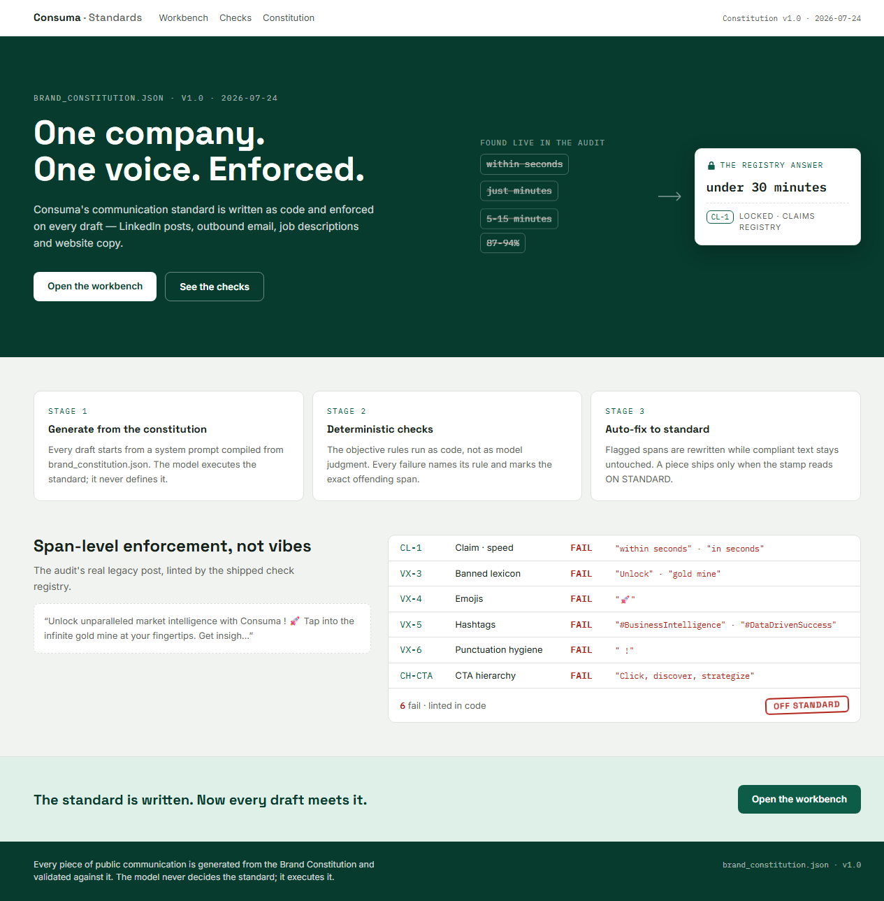
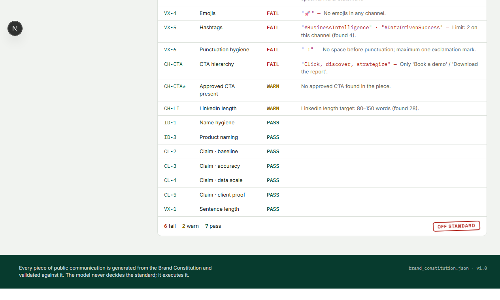
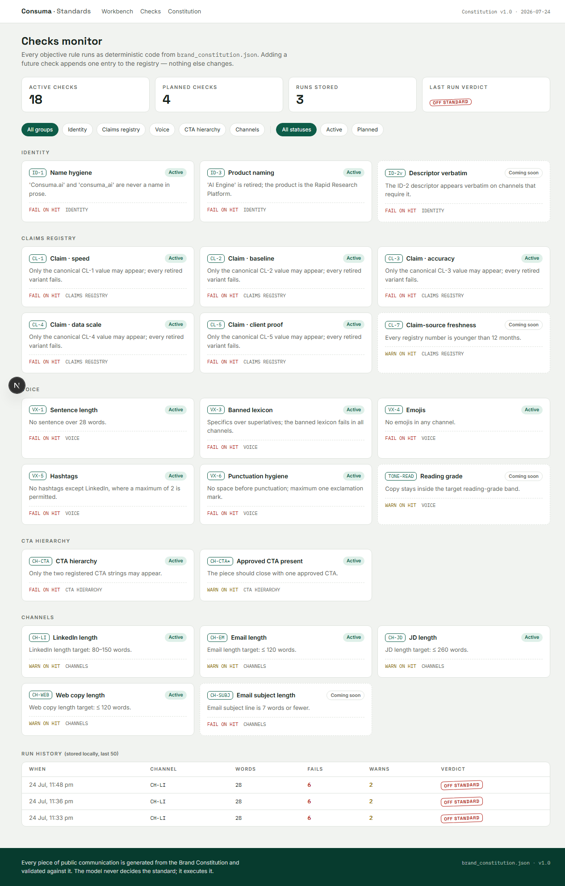

# Consuma · Communication Standardisation Tool

**Live:** _add your deployment URL here after hosting_

A two-stage content-governance app for Consuma. It generates on-brand content (LinkedIn
posts, outbound emails, job descriptions, website copy) strictly from a machine-readable
**Brand Constitution**, then validates every draft with a **deterministic check registry
written in code**. The model executes the standard; it never defines it.

- `constitution/brand_constitution.json` is the single source of truth — the prompt
  compiler, the check registry, and every page render from it. Nothing is hardcoded twice.
- Objective rules run as regex/string logic in TypeScript. Every failure cites a rule ID
  and the exact offending span, marked inline in the draft.
- Only two genuinely subjective rules (VX-2 max-one-metaphor and per-channel structure)
  are model-judged, via a strict-JSON audit endpoint.
- Auto-fix rewrites only flagged spans, then re-lints. A piece ships only when the ledger
  shows zero FAIL rows — the **ON STANDARD** stamp.
- Adding a future check = appending one object to `lib/checks.ts`. No UI or route edits
  (proven in the test suite).

## Screenshots

| Landing — the number soup, resolved | Inline violations with rule-ID chips |
| --- | --- |
|  |  |

| Compliance ledger and stamp | Checks monitor |
| --- | --- |
|  |  |

## Stack

Next.js 15 (App Router) · TypeScript · Tailwind CSS v4 · Framer Motion ·
`@anthropic-ai/sdk` (claude-sonnet-4-6) · Vitest. No database — run history lives in
`localStorage`; API routes are stateless (Vercel serverless).

## Run locally

```bash
npm install
cp .env.local.example .env.local   # then put your ANTHROPIC_API_KEY in it
npm run dev                        # http://localhost:3000
npm test                           # 54 tests: every active check has pass+fail cases,
                                   # the prompt is provably derived from the JSON,
                                   # and the landing copy passes its own linter
```

Everything deterministic (lint, auto-highlighting, ledger, checks monitor, constitution)
works without an API key. Generation, model audit and auto-fix need the key.

## Deploy (Vercel)

```bash
npm run build        # must pass first
vercel               # preview
vercel --prod        # production
```

Set `ANTHROPIC_API_KEY` in Vercel → Project → Settings → Environment Variables before
the first production deploy.

## Repository map

```
constitution/brand_constitution.json   the standard (SSOT, v1.0)
lib/                                   constitution loader · prompt compiler ·
                                       check registry · runChecks · audit parser
app/api/generate                       draft generation + fix mode
app/api/audit                          Stage-2b strict-JSON model audit
app/tool                               workbench: generate → lint → fix
app/checks                             registry monitor + run history
app/constitution                       the standard, human-readable
tests/                                 Vitest suite for lib/ + landing copy
```
